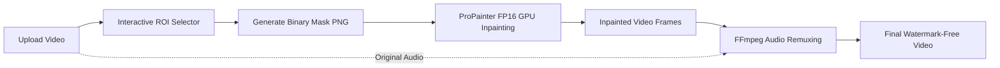

# 🎬 Local Video Watermark Remover (ProPainter + Gradio)

[](https://www.python.org/)
[](https://pytorch.org/)
[-blue)](https://github.com/sczhou/ProPainter)
[](https://gradio.app/)
[](https://ffmpeg.org/)

A Windows-native utility to seamlessly remove static and dynamic watermarks (such as Gemini watermarks) from video files using the state-of-the-art **ProPainter** video inpainting model, packaged with a rich **Gradio** web interface and **FFmpeg** audio stream preservation.

---

## ✨ Key Features

- **🎯 Interactive Visual ROI Selection (Mouse Drag & Draw)**:
  - **🖱️ Mouse Drag & Freehand Brush**: Drag and paint directly over the watermark on the video canvas with your mouse; coordinates and bounding boxes are automatically computed and synchronized.
  - **⏱️ Timeline Frame Scrubber**: If the watermark is difficult to see due to the background color in the first frame, scrub the timeline slider or click quick jump buttons (0%, 25%, 50%, 75%, End) to load any clear frame onto the ROI canvas in real time.
  - **📐 Custom Precision Sliders**: Live bounding box overlay and pixel coordinate controls.
- **⚡ One-Click Presets**:
  - Quick presets for **Gemini (1080p Bottom-Right)**, **Gemini (9:16 Shorts)**, **Gemini (1:1 Square)**, **Bottom-Right**, **Bottom-Left**, and **Top-Right**.
- **🚀 GPU-Accelerated FP16 Inpainting**:
  - Leverages ProPainter temporal flow completion & transformer inpainting with `--fp16` half precision.
  - Smooth execution on NVIDIA RTX GPUs (e.g. RTX 3080 / 40-series).
- **🔊 Complete Audio Preservation**:
  - ProPainter only processes video frames; our pipeline uses **FFmpeg** to automatically mux and synchronize the original video's audio tracks into the final output.
- **🛠️ Advanced VRAM Management**:
  - Configurable `subvideo_length`, `neighbor_length`, `mask_dilates`, and `resize_ratio` for handling large 4K / long duration videos without Out-Of-Memory (OOM) errors.
- **🖱️ Windows One-Click Launcher**:
  - Includes `run.bat` for instant startup.

---

## 🏗️ Pipeline Architecture



---

## 📋 Prerequisites

- **OS**: Windows 10 / 11 (x64)
- **GPU**: NVIDIA GPU with CUDA support (RTX 3060 / 3070 / 3080 / 40-series recommended, >= 6GB VRAM)
- **Python**: Python 3.10 or 3.11 (64-bit)
- **FFmpeg**: `ffmpeg` must be installed and added to system `PATH`
  - *Verify via*: `ffmpeg -version`

---

## ⚙️ Installation & Setup

### 1. Clone Repository
```powershell
git clone git@github.com:tramper2/RmWaterMark.git
cd RmWaterMark
```

### 2. Create Virtual Environment & Install Dependencies
```powershell
# Create virtual environment
python -m venv venv

# Activate virtual environment
.\venv\Scripts\activate

# Install PyTorch with CUDA support (cu121)
pip install torch torchvision --index-url https://download.pytorch.org/whl/cu121

# Install project dependencies
pip install -r requirements.txt
```

### 3. Download Model Weights
Download the required ProPainter weights (`ProPainter.pth`, `recurrent_flow_completion.pth`, `raft-things.pth`):
```powershell
python download_weights.py
```

---

## 🚀 How to Run

### Method 1: Double-Click Launcher (Windows)
Simply double-click `run.bat` in the project root folder.

### Method 2: Command Line
```powershell
.\venv\Scripts\activate
python app.py
```
Open your web browser and navigate to: **`http://127.0.0.1:7860`**

---

## 📖 How to Use

1. **Upload Video**: Drag & drop your video into the **Source Video** box.
2. **Set Watermark Region**:
   - Choose a preset (e.g. *Gemini (9:16 Shorts)*) or fine-tune `X`, `Y`, `Width`, `Height` sliders.
   - You can also scrub the **Timeline Frame Scrubber** to jump to a scene where the watermark is clearest, and paint directly over it with your mouse.
   - Inspect the **ROI Visual Preview** to make sure the red box fully covers the watermark.
3. **Optimize Settings (Optional)**:
   - Expand *Advanced Optimization Settings* to adjust `Subvideo Length` or `Mask Dilation` if needed.
4. **Start Removal**: Click **🚀 Start Watermark Removal**.
5. **Download Output**: Preview and download the final watermarked-free video with full audio synchronization.

---

## 🎯 Recommended Watermark Preset Coordinates

| Aspect Ratio / Platform | Resolution | X (Left) | Y (Top) | Width | Height | Description |
| :--- | :--- | :---: | :---: | :---: | :---: | :--- |
| 📱 **Gemini (9:16 Vertical / Shorts)** | **1080 × 1920** | **865** | **1700** | **80** | **80** | Gemini logo / text watermark (Bottom-Right) |
| 🖥️ **Gemini (16:9 Landscape)** | **1920 × 1080** | **1700** | **950** | **200** | **100** | Standard 1080p Bottom-Right watermark |
| 🔲 **Gemini (1:1 Square)** | **1080 × 1080** | **870** | **980** | **190** | **80** | Square video Bottom-Right watermark |

> [!TIP]
> 영상 배경 색상이 워터마크 색과 동일하여 잘 보이지 않는 경우, **1번 패널 하단의 타임라인 슬라이더(또는 25%/50% 버튼)**를 이용해 워터마크가 선명하게 보이는 장면으로 이동하여 지정할 수 있습니다.

---

## ⏱️ Model Initialization Notice (초기 로딩 시간 안내)

> [!NOTE]
> **🚀 시작 시 딥러닝 모델 로딩 지연 안내**:
> 워터마크 제거를 처음 실행할 때, 대용량 신경망 모델(**ProPainter InpaintGenerator**, **Recurrent Flow Completion**, **RAFT 광학 흐름 신경망**) 및 사전 학습 가중치 파라미터를 GPU VRAM으로 적재하고 초기 메모리 구조를 빌드하는 과정이 수반됩니다.
> 따라서 **첫 1회 실행 시 약 10초 ~ 30초 정도의 모델 준비 시간**이 소요될 수 있으며, 초기화가 완료된 후부터는 초당 수 프레임 이상의 빠른 GPU 가속으로 실시간 처리됩니다.

---

## 📂 Project Structure

```text
RmWaterMark/
├── ProPainter/               # ProPainter core algorithms & models
├── weights/                  # Model weights (ProPainter.pth, etc.)
├── app.py                    # Main Gradio application & processing pipeline
├── download_weights.py       # Pretrained weights verification & downloader
├── requirements.txt          # Python dependencies
├── run.bat                   # Windows one-click launcher
├── test_pipeline.py          # End-to-end automated test script
├── .gitignore                # Git ignore rules for virtualenv & weights
└── README.md                 # Project documentation
```

---

## 📜 Acknowledgements & References

- **ProPainter**: [Improving Propagation and Transformer for Video Inpainting (ICCV 2023)](https://github.com/sczhou/ProPainter)
- **Gradio**: [Build & Share Machine Learning Apps](https://gradio.app/)
- **FFmpeg**: [A complete, cross-platform solution to record, convert and stream audio and video](https://ffmpeg.org/)
