# 🎨 AI Watermark & Object Remover (Image & Video) - Magic Eraser

[](https://www.python.org/)
[](https://pytorch.org/)
[-success)](https://github.com/advimman/lama)
[-blue)](https://github.com/sczhou/ProPainter)
[](https://gradio.app/)
[](https://ffmpeg.org/)

**이미지(Image) 및 동영상(Video)**에서 워터마크(Gemini, DALL-E, TikTok, 로고, 자막 등)뿐만 아니라 **사진 속 특정 사물/오브젝트(얼굴, 가방, 화분, 인물, 가구, 불필요한 물체 등)**를 인공지능으로 감쪽같이 제거하고, **C2PA / EXIF 메타데이터 및 AI 비가시성 워터마크(SynthID)**를 100% 소거하는 Windows 로컬 GUI 애플리케이션(매직 이레이저)입니다.

---

## ✨ Key Features

### 🖼️ 1. 이미지 워터마크 & 사물/오브젝트 지우개 (Image & Object Magic Eraser)
- **🧠 SOTA AI 인페인팅 엔진 (LaMa - Fast Fourier Convolutions)**:
  - **사물/오브젝트 제거**: 얼굴, 가방, 화분, 행인, 전봇대, 가구 등 사진 속 특정 객체를 지우면 AI가 사물 뒤에 가려져 있던 바닥 타일, 벽지, 자연 풍경 등의 질감과 패턴을 사실적으로 복원.
  - **워터마크 제거**: 반투명 워터마크, 텍스트, 자막, 플랫폼 로고 무손실 복원.
- **🎯 주변 배경색 자동 채우기 지우개 (Auto Background Color Fill)**:
  - 단색/문서/상품 사진/웹툰 배경의 경우 주변 배경색을 정밀 스포이트 분석하여 AI 왜곡 없이 100% 깔끔하게 배경색으로 메워 지우기.
- **🎨 사용자 지정 색상 채우기 (Custom Color Picker Fill)**:
  - 컬러 피커를 통해 원하는 색상(흰색 `#FFFFFF`, 검은색, 커스텀 색상)을 직접 선택하여 지우기.
- **🖌️ 가변 브러시 크기 원클릭 조절**:
  - `30px (기본)`, `60px`, `100px`, `200px`, `300px (특대)` 원클릭 브러시 크기 전환 지원.
- **📐 임의의 모든 해상도 & 화면비 완벽 지원**:
  - SD, HD, FHD, 4K, 8K 및 가로형(16:9), 세로형(9:16), 정방형(1:1) 등 어떤 크기의 이미지도 제약 없이 처리.
- **⚡ 스마트 고해상도(4K/8K) 국소 크롭 가속 (Smart Patch Mode)**:
  - 4K/8K 대용량 이미지에서도 지울 영역 주변만 스마트 크롭하여 **0.1~0.4초 만에 초고속 인페인팅** 수행.
  - 지우는 영역 외 나머지 영역은 **100% 원본 픽셀 화질 무손실 유지**.
- **🎨 유연한 영역 지정**:
  - **마우스 브러시/지우개 직접 칠하기 (`gr.ImageEditor`)**: 비정형 사물이나 로고를 마우스로 자유롭게 칠해 정밀 제거.
  - **원클릭 위치 프리셋**: 16:9 BR, 9:16 BR, 1:1 BR, 우측 하단, 좌측 하단, 상단, 중앙 등 원클릭 설정.
  - **정밀 사각형 좌표 슬라이더 (X, Y, W, H)**: 실시간 빨간색 바운딩 박스 미리보기.
- **🛡️ 이미지 메타데이터 & AI 비가시성 워터마크(SynthID) 완전 소거**:
  - EXIF, XMP, IPTC, C2PA 매니페스트 100% 0바이트 소거.
  - 픽셀 격자 미세 교란을 통해 SNS/플랫폼 AI 자동 감지 차단.
- **📁 원본 파일명 유지 저장**:
  - 결과물을 `results/[원본파일명]_v2.[확장자]` 형태로 자동 저장.

---

### 🎬 2. 동영상 워터마크 제거 (Video Watermark Remover)
- **ProPainter ICCV 2023 딥러닝 비디오 인페인팅**:
  - 시공간 광학 흐름(Optical Flow) 및 트랜스포머 기반 동영상 배경 복원.
- **⏱️ 타임라인 프레임 스크러버**:
  - 타임라인을 자유롭게 이동하여 워터마크가 선명하게 보이는 장면을 불러와 마우스로 브러시 마스크 지정.
- **🎵 오디오 무손실 동기화**:
  - FFmpeg 기반 원본 음성 스트림 완벽 보존 및 위상 재구성.

---

### 🧹 3. 기존 동영상 & 이미지 즉시 세척기 (Instant Sanitizer)
- 인페인팅 없이도 이미 생성된 모든 동영상(MP4/MOV) 또는 이미지(PNG/JPG/WEBP)를 1초 만에 C2PA/EXIF/SynthID 완전 소거.

---

## 🏗️ Architecture

```mermaid
flowchart TD
    subgraph Image Pipeline
        A1[Upload Image Any Size] --> B1[Brush Canvas / Presets / ROI Sliders]
        B1 --> C1[Smart Patch Bounding Box]
        C1 --> D1[LaMa Fourier Convolutions AI Inpainting]
        D1 --> E1[Gaussian Feathered Seamless Blend]
        E1 --> F1[EXIF / C2PA / SynthID Pixel Wipe]
        F1 --> G1[Clean Watermark-Free Image]
    end

    subgraph Video Pipeline
        A2[Upload Video] --> B2[Timeline Scrub & Brush ROI]
        B2 --> C2[Smart Local ROI Cropper]
        C2 --> D2[ProPainter FP16 GPU Inpainting]
        D2 --> E2[Gaussian Feather Blending]
        E2 --> F2[FFmpeg Audio Stream & C2PA Box Sanitizer]
        F2 --> G2[100% Clean Output Video]
    end
```



---

## 📋 System Requirements

- **OS**: Windows 10 / 11 (64-bit)
- **GPU**: NVIDIA GPU with CUDA (RTX 3060 / 3070 / 3080 / 40-series 권장, CPU 모드도 지원)
- **Python**: Python 3.10 또는 3.11
- **FFmpeg**: 시스템 PATH에 등록된 FFmpeg (`ffmpeg -version` 확인)

---

## ⚙️ Installation & Setup

### 1. 가상환경 생성 및 의존성 패키지 설치
```powershell
# 가상환경 활성화
.\venv\Scripts\activate

# PyTorch CUDA 12.1 설치 (필요시)
pip install torch torchvision --index-url https://download.pytorch.org/whl/cu121

# 의존성 패키지 설치
pip install -r requirements.txt
```

### 2. 사전 학습 가중치 다운로드
LaMa(`big-lama.pt`) 및 ProPainter 모델 가중치를 자동으로 다운로드 및 검증합니다:
```powershell
python download_weights.py
```

---

## 🚀 How to Run

### 방법 1: 원클릭 실행 파일 (Windows)
프로젝트 루트 폴더의 **`run.bat`** 파일을 더블 클릭합니다.

### 방법 2: 터미널 실행
```powershell
.\venv\Scripts\activate
python app.py
```
웹 브라우저에서 **`http://127.0.0.1:7860`** 으로 접속합니다.

---

## 📖 사용 방법 (How to Use)

### 🖼️ 1. 이미지 워터마크 & 사물/오브젝트 지우기
1. **이미지 업로드**: `1. 이미지 워터마크 & 사물/오브젝트 지우개` 탭에 사진을 업로드합니다.
2. **지울 영역 칠하기 (브러시)**:
   - **사물/오브젝트(얼굴, 가방, 화분, 사람 등)**: `60px`, `100px`, `200px`, `300px` 브러시를 선택하여 사물 전체와 **바닥 그림자**까지 넉넉하게 칠합니다.
   - **워터마크/글자**: `30px` 기본 브러시로 글자나 로고를 칠하거나, 우측 상단 `원클릭 프리셋` 버튼을 누릅니다.
3. **인페인팅 모드 선택**:
   - **일반 사진 (풍경, 거실, 바닥, 벽 등)**: `LaMa (AI SOTA)` 선택 (AI가 뒤편 배경을 감쪽같이 생성).
   - **단색/스튜디오 사진 (흰색 배경, 상품 사진, 문서)**: `🎯 주변 배경색 자동 채우기` 선택.
4. **실행**: **`🚀 제거 시작`** 버튼 클릭 $\rightarrow$ `results/[원본파일명]_v2.[확장자]`로 고화질 저장.

> 💡 **사물/오브젝트 제거 꿀팁**:
> - 화분이나 가방 아래에 드리워진 **바닥 그림자까지 함께 칠해주시면** 사물이 원래 없었던 것처럼 가장 자연스럽습니다.
> - 외곽에 미세한 테두리가 남지 않도록 기본 `마스크 확장 반경 (5px)` 설정을 켜두시는 것을 권장합니다.

---

## 📂 Project Structure

```text
RmWaterMark/
├── ProPainter/               # ProPainter video inpainting engine
├── weights/                  # Model weights (big-lama.pt, ProPainter.pth, etc.)
├── app.py                    # Main Gradio application (Image + Video + Sanitizer)
├── image_inpainter.py        # LaMa Fourier AI & OpenCV image inpainting engine
├── download_weights.py       # Weights downloader (LaMa + ProPainter)
├── test_image_pipeline.py    # Automated image pipeline test suite
├── test_pipeline.py          # Automated video pipeline test suite
├── requirements.txt          # Python dependencies
├── run.bat                   # Windows one-click launcher
└── README.md                 # Project documentation
```

---

## 📜 Acknowledgements & References

- **LaMa**: [Resolution-robust Large Mask Inpainting with Fourier Convolutions (WACV 2022)](https://github.com/advimman/lama)
- **ProPainter**: [Improving Propagation and Transformer for Video Inpainting (ICCV 2023)](https://github.com/sczhou/ProPainter)
- **Gradio**: [Build & Share Machine Learning Web Apps](https://gradio.app/)
- **FFmpeg**: [Audio/Video Processing Suite](https://ffmpeg.org/)
